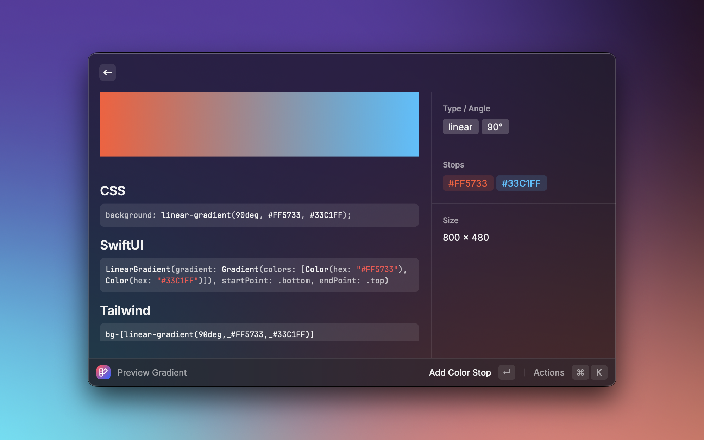

<!-- TOP ROW OF BADGES -->

[![Contributors][contributors-shield]][contributors-url]
[![Forks][forks-shield]][forks-url]
[![Stargazers][stars-shield]][stars-url]
[![Issues][issues-shield]][issues-url]
[![MIT License][license-shield]][license-url]

<a name="readme-top"></a>

<div align="center">
  <a href="https://www.raycast.com/smcnab1/gradient-generator">
    
  </a>

  <h3 align="center">Gradient Generator</h3>
  <p align="center">
    A Raycast extension to create, preview, randomize, save and export gradients, using them in your next project.
    <br />
    <a href="https://www.raycast.com/smcnab1/gradient-generator"><strong>Install the extension »</strong></a>
    <br />
    <br />
    <a href="https://github.com/raycast/extensions/issues/new?title=%5BGradient+Generator%5D+...&template=extension_bug_report.yml&labels=extension%2Cbug&extension-url=https%3A%2F%2Fwww.raycast.com%2Fsmcnab1%2Fgradient-generator&body=%0A%3C%21--%0APlease+update+the+title+above+to+consisely+describe+the+issue%0A--%3E%0A%0A%23%23%23+Extension%0A%0Ahttps%3A%2F%2Fraycast.com%2F%23%7Bextension_path%28extension%29%7D%0A%0A%23%23%23+Description%0A%0A%3C%21--%0APlease+provide+a+clear+and+concise+description+of+what+the+bug+is.+Include+screenshots+if+needed.+Please+test+using+the+latest+version+of+the+extension%2C+Raycast+and+API.%0A--%3E%0A%0A%23%23%23+Steps+To+Reproduce%0A%0A%3C%21--%0AYour+bug+will+get+fixed+much+faster+if+the+extension+author+can+easily+reproduce+it.+Issues+without+reproduction+steps+may+be+immediately+closed+as+not+actionable.%0A--%3E%0A%0A1.+In+this+environment...%0A2.+With+this+config...%0A3.+Run+%27...%27%0A4.+See+error...%0A%0A%23%23%23+Current+Behavior%0A%0A%23%23%23+Expected+Behavior%0A%0A">Report Bug</a>
    ·
    <a href="https://github.com/raycast/extensions/issues/new?title=%5BGradient+Generator%5D+...&template=extension_feature_request.yml&labels=extension%2Cfeature%2Brequest&extension-url=https%3A%2F%2Fwww.raycast.com%2Fsmcnab1%2Fgradient-generator&body=%0A%3C%21--%0APlease+update+the+title+above+to+consisely+describe+the+issue%0A--%3E%0A%0A%23%23%23+Extension%0A%0A%23%7Brepository_url%28extension.latest_version%29%7D%0A%0A%23%23%23+Description%0A%0A%3C%21--%0ADescribe+the+feature+and+the+current+behavior%2Fstate.%0A--%3E%0A%0A%23%23%23+Who+will+benefit+from+this+feature%3F%0A%0A%23%23%23+Anything+else%3F%0A%0A%3C%21--%0ALinks%3F+References%3F+Anything+that+will+give+us+more+context%21%0ATip%3A+You+can+attach+images+or+log+files+by+clicking+this+area+to+highlight+it+and+then+dragging+files+in.%0A--%3E%0A%0A">Request Feature</a>
  </p>
</div>

<details>
  <summary>Table of Contents</summary>

- [About The Project](#about-the-project)
  - [Features](#features)
  - [Built With](#built-with)
- [Getting Started](#getting-started)
  - [Prerequisites](#prerequisites)
  - [Install](#install)
  - [Usage](#usage)
- [Back Matter](#back-matter)
  - [Roadmap](#roadmap)
  - [Contributing](#contributing)
  - [License](#license)

</details>

## About The Project
<div align="center">
  <a href="https://www.raycast.com/smcnab1/gradient-generator">
    
  </a>
  </div>

**Gradient Generator** is a minimalist, local-first Raycast extension for crafting gradients. Create a gradient, preview it in a large panel, copy ready-to-use snippets (CSS, SwiftUI, Tailwind arbitrary value), generate random gradients, and save your favorites locally.

### Features

- Create linear, radial, or conic gradients (with angle for linear)
- Large preview and gradient metadata
- Copy snippets: CSS, SwiftUI, Tailwind arbitrary value
- Random gradient generator (2–3 stops, now with explicit control over stop count)
- Saved gradients list with quick preview, inline rename (`⌘R`), and delete
- Export gradients as PNG (copy to clipboard or save at preset/custom sizes, with optional transparency)
- Export gradients as scalable SVG markup (ideal for Figma, web, or design workflows)
- Tailwind export mode toggle (switch between arbitrary class or plain CSS)
- Local storage only (no network calls)
- Improved form ergonomics: better tab order, conditional angle field, and reset action
- Validation hardening: no crashes from invalid stops or colour input

### Built With

- TypeScript + React
- `@raycast/api`, `@raycast/utils`

## Getting started

### Prerequisites

- macOS with Raycast installed

### Install

#### From Raycast Store (production):
Install via [Raycast Store](https://www.raycast.com/smcnab1/gradient-generator)

#### From source (development):

```bash
npm install
npm run dev
```

Build locally:

```bash
npm run build
```

### Commands

- **Create Gradient** — form to define type, colours, and angle; pushes to Preview
- **Random Gradient** — generates a random 2–3 stop gradient (user can now choose stop count) and shows Preview
- **Saved Gradients** — list of saved gradients with colour tags; inline rename (`⌘R`); open Preview; delete

## Back Matter

### Contributing

Contributions welcome. Please open an issue to discuss changes first.

1. Fork the project
2. Create a feature branch (`git checkout -b feature/my-change`)
3. Commit your changes (`git commit -m 'feat: ...'`)
4. Push to your branch (`git push origin feature/my-change`)
5. Open a Pull Request

### License

MIT — see [LICENSE](./LICENSE) for details.

<!-- MARKDOWN LINKS & IMAGES -->

[contributors-shield]: https://img.shields.io/github/contributors/smcnab1/gradient-generator.svg?style=for-the-badge
[contributors-url]: https://github.com/smcnab1/gradient-generator/graphs/contributors
[forks-shield]: https://img.shields.io/github/forks/smcnab1/gradient-generator.svg?style=for-the-badge
[forks-url]: https://github.com/smcnab1/gradient-generator/network/members
[stars-shield]: https://img.shields.io/github/stars/smcnab1/gradient-generator.svg?style=for-the-badge
[stars-url]: https://github.com/smcnab1/gradient-generator/stargazers
[issues-shield]: https://img.shields.io/github/issues/smcnab1/gradient-generator.svg?style=for-the-badge
[issues-url]: https://github.com/smcnab1/gradient-generator/issues
[license-shield]: https://img.shields.io/github/license/smcnab1/gradient-generator.svg?style=for-the-badge
[license-url]: https://github.com/smcnab1/gradient-generator/blob/main/LICENSE
[product-screenshot]: media/gradient-generator-1.png
